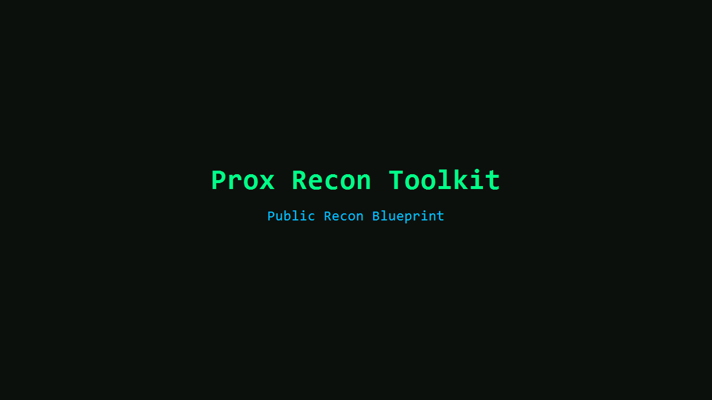
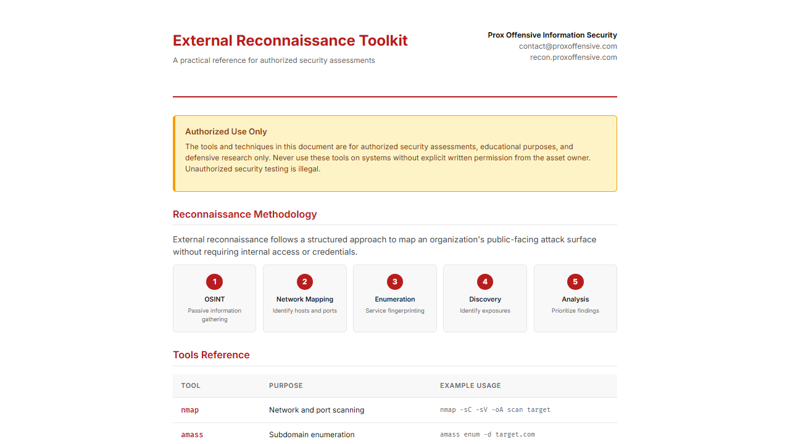

# Prox Recon Toolkit


Prox Recon Toolkit is a public-safe recon blueprint for client-facing reporting. It is a static site that pairs a landing page with a sample audit to demonstrate how recon findings can be presented clearly and consistently.

This repo focuses on methodology, storytelling, and report structure. It intentionally omits step-by-step offensive commands and internal identifiers.

## Quickstart (local)
Option 1: open `index.html` directly in your browser.

Option 2: run a simple local server:

```bash
python -m http.server 8000
```

Then visit `http://localhost:8000/`.

Optional (Node):

```bash
npx serve .
```

## Deploy (static hosting)
This is a static site. Upload the repository contents to your static host of choice (GitHub Pages, S3, Netlify, etc.).

Minimal set to deploy:
- `index.html`
- `toolkit.html`
- `sample-audit/`
- `assets/`
- `ProxFlatVector.png`

## Structure
- `index.html`: Landing page.
- `toolkit.html`: Toolkit overview page.
- `sample-audit/`: Sample recon audit (HTML + PDF).
- `assets/`: Favicon and screenshots.

## Screenshots




## OPSEC gate
Run the local scan before publishing changes:

```bash
python scripts/opsec_scan.py --root .
```
